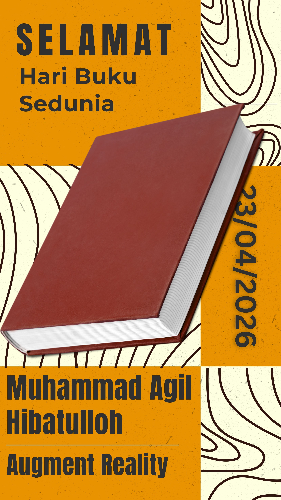

Nama: Muhammad Agil Hibatulloh  
Mata Kuliah: Augmented Reality  
Dosen: Narandha Arya Ranggianto S.Kom., M.Kom  

Deskripsi Aplikasi
Aplikasi ini merupakan implementasi Augmented Reality berbasis marker menggunakan Unity dan Vuforia Engine.  
Aplikasi dapat mendeteksi gambar marker dan menampilkan objek 3D berupa buku di atas marker secara real-time.

Teknologi yang Digunakan
- Unity 2022 (Built-in Render Pipeline)
- Vuforia Engine
- Image Target (marker buatan sendiri)

Link Drive : https://drive.google.com/drive/folders/16NNxrLOVW3384M9tGz3FhDCnchCvIMMv?usp=sharing (file lebih 25mb tidak bisa up github)
Link Youtube: https://youtu.be/iqOEHGktU5w

Marker

